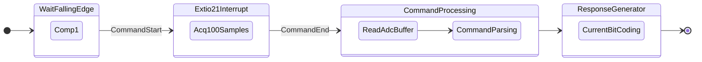

# DSI3 Simulator Board
```
000000000.050400: ================================
000000000.052600: DSI3 Slave Simulator Started
000000000.054800: Type 'help' for available commands
000000000.057200: ================================
000000000.059500: 
> 
000000000.060500: ADC buffer addr: 0x30000000
000000000.062600: 
> 
000000000.063700: OK: adc_buffer is 32-byte aligned.
000000000.066100: 
> sysinfo
000000005.439900:   System Information:
000000005.441800:   Board: DSI3 Simulator Board
000000005.443900:   MCU: STM32H743VIT6
000000005.445700:   Clock: 400 MHz
000000005.447300:   CLI Version: 1.0
000000005.449100: 
> help
000000006.276200: 
Available Commands:

000000006.278100:   help          - Display this help message
000000006.280900:   sysinfo       - Display system information
000000006.283700:   heartbeat     - Toggle heartbeat LED
000000006.286300:   startcomp     - Start comparator for triggering ADC captures
000000006.289900:   testadc       - Test ADC capture of 128 samples via SPI2 DMA
000000006.293500:   getbuf        - Get ADC buffer contents
000000006.296200:   testresp      - Send test response for BADC0DB4 symbol
```


[](LICENSE)
[](https://www.st.com/en/microcontrollers-microprocessors/stm32h743vi.html)

## Overview

This project implements a **DSI3 (Distributed Systems Interface 3) protocol simulator** based on an STM32H743VIT6 microcontroller. It is designed to receive DSI3 commands, acquire analog signals via an external ADC (RS1473), and generate current‑pulse responses compliant with the DSI3 physical layer.

The system is intended for testing, debugging, and emulating DSI3 slave devices in automotive or industrial distributed sensor/actuator networks.

## Hardware Architecture

- **MCU**: STM32H743VIT6 (100‑pin, 25 MHz HSE)
- **ADC**: RS1473, connected via **SPI2** (Receive‑Only Master, 16‑bit frames, 12‑bit effective data)
- **Analog inputs**: Two channels switched by GPIO PC9
  - Channel 0: current measurement (default, scaling factor `ADC_Ki = 1.5 * 50`)
  - Channel 1: voltage measurement (scaling factor `ADC_Ku = 3.3 / 27.3`)
- **Sampling trigger**: Comparator COMP1 (falling edge) → starts `HAL_SPI_Receive_DMA()` to capture 100 samples
- **DMA**: Normal mode, 16‑bit, buffer size = 100 samples
- **DSI3 output**: Timer 1 driven current sources
  - `GPIO_PE9`: 12 mA pulse
  - `GPIO_PE11`: 24 mA pulse
- **Network**: MII 100 Mbps Ethernet (PHY reset on `GPIO_PE12`)
- **Debug & Indicators**:
  - `USART1`: System console with CLI
  - `GPIO_PD2`: Heartbeat LED
  - `GPIO_PD3`: DSI3 command received indicator / general purpose debug
- **Power / Boot**: BOOT0 mode for USART1 program download

## Features

- [x] CLI console over USART1 for system info, ADC read/set, and debugging
- [x] Comparator interrupt toggles `GPIO_PD3` (DSI3 command indicator) of first command pulse
- [x] SPI DMA acquisition of 100 ADC samples on each first comparator trigger
- [x] DMA completion interrupt – processes the acquired data
- [x] DSI3 command parser (protocol decoding)
- [x] DSI3 response generation (12 mA / 24 mA current pulses)
- [ ] Ethernet MII stack (planned)

## Project Structure
```
    PIO-DSI3/
    ├── Core/
    ├── Drivers/
    ├── boards/
    ├── src/
    │   ├── comp.c
    │   ├── dma.c
    │   ├── eth.c
    │   ├── gpio.c
    │   ├── main.c
    │   ├── spi.c
    │   ├── stm32h7xx_hal_msp.c
    │   ├── stm32h7xx_it.c
    │   ├── system_stm32h7xx.c
    │   ├── tim.c
    │   └── usart.c
    └── platformio.ini
```
## Getting Started

### Prerequisites

- **STM32CubeMX** – to regenerate the project for your toolchain (IAR, Keil, STM32CubeIDE, or Makefile)
- **VS Code** (or any compatible toolchain) for building
- **Serial terminal** (PuTTY, minicom, screen) for CLI access over USART1
- **DSI3 master / oscilloscope** for testing the generated current pulses

### Build and Flash

1. Open `cubemx-dsi3.ioc` with STM32CubeMX.
2. Generate code for your preferred IDE / toolchain.
3. Build the project.
4. Flash via USART1 (BOOT0 mode) or using a debug probe (SWD/JTAG).

### Console Access

Connect to USART1 (baud rate 115200, 8N1). After reset you will see the system banner and a CLI prompt.

Available CLI commands (for actual commands see main.c):

| Command | Description |
|---------|-------------|
| `sysinfo` | Display system information (MCU frequency, ADC scaling factors, buffer status) |
| `testadc` | Read and print ADC samples from the specified channel (0 or 1) |
| `adc_set <channel>` | Set the active ADC channel (0 = current, 1 = voltage) – defaults to channel 0 |
| `help`  | Show command summary |

## Functional Description

### ADC Acquisition Flow

1. The DSI3 master sends a command on the bus.
2. The comparator (COMP1) detects the falling edge of the incoming signal.
3. The comparator ISR toggles `GPIO_PD3` (command indicator) and starts `HAL_SPI_Receive_DMA()` to capture 100 samples from the active ADC channel.
4. After DMA completes, a callback processes the raw 16‑bit values, applies the corresponding scaling factor (`ADC_Ki` or `ADC_Ku`), and stores the result.
5. The processed data is then passed to the DSI3 command parser.
6. According to the parsed command, the system generates a response using Timer 1 current pulses (12 mA or 24 mA).


### DSI3 Response Generation

- **12 mA pulse** – `GPIO_PE9` toggled by Timer 1 channel
- **24 mA pulse** – `GPIO_PE11` toggled by Timer 1 channel

Timing and encoding follow the DSI3 specification (detailed in `/pdf`).

## Debugging

- Use an oscilloscope to monitor the comparator input, SPI clock, and the current output pins.

For example, test code BADC0DB4 simulating 8 symbols of 3-chip / 4-bit response:
```
> testresp
000000093.264600: Starting test response transmission...

000000093.267200: Transmitting symbols: 
000000093.269000: B
000000093.270000: A
000000093.270900: D
000000093.271800: C
000000093.272700: 0
000000093.273700: D
000000093.274600: B
000000093.275500: 4
```


Legend: Yellow - 24mA, Blue - 12mA

- The CLI allows manual ADC reads and channel switching, independent of the DSI3 trigger:
```
> testadc
000000003.238300:   Testing ADC capture.
000000003.240200:   ADC capture test initiated.
000000003.242400: 
> getbuf
000000004.559500: 
  ADC Buffer Contents:
  0 - 0xFFA8
  1 - 0xFFE8
  2 - 0xFFCC
  3 - 0xFFDC
  4 - 0xFFB8
  5 - 0xFFEC
  6 - 0xFFFC
  7 - 0xFFFC
```
- The heartbeat LED (`GPIO_PD2`) blinks at 1 Hz to indicate system health.

## Future Enhancements

- Full Ethernet MII stack for remote monitoring / configuration
- DSI3 command set extension (broadcast, addressed commands, etc.)
- Configurable ADC sample count via CLI
- Error handling for DMA overruns / framing errors

## License

This project is licensed under the MIT License – see the [LICENSE](LICENSE) file for details.

## Acknowledgements

- STMicroelectronics for the STM32H7 HAL and CubeMX tools
- RS1473 ADC datasheet contributors
- DSI3 protocol specification (provided in `/pdf`)

---
**Note:** This is a simulator – always verify compliance with the official DSI3 standard before using in a production environment
